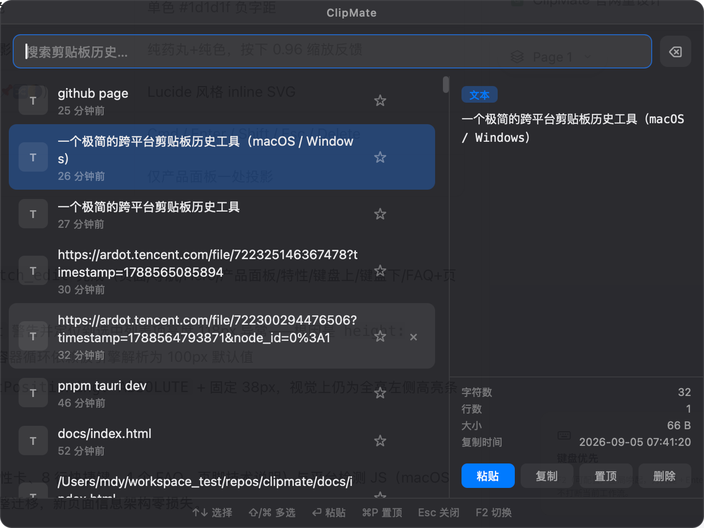

# Clipmate

一个极简的**跨平台剪贴板历史工具**（macOS / Windows）：按下热键唤起面板，方向键选择，回车粘贴回当前应用。

> 📥 **下载安装**：[GitHub Releases](https://github.com/luwuer/clipmate/releases/latest)（macOS Universal DMG / Windows NSIS 安装包）· [产品主页](https://luwuer.github.io/clipmate/)


## 特性

- **F2**（可配置）唤起面板，方向键选择，Enter 粘贴回当前应用，Esc 关闭
- 记录 **文本** 与 **图片**，支持 **搜索过滤**
- **历史持久化**：重启后历史不丢失（JSONL 落盘，图片仅内存）
- **收藏/置顶**：⌘P pin 重要条目，永不被淘汰
- **多选批量**：Shift/⌘ 多选，批量拼接粘贴、批量删除
- **主题切换**：dark / light，菜单栏一键切换
- **面板位置**：屏幕顶部居中（默认）/ 跟随光标，两种模式可切换
- **开机自启**：菜单栏勾选即可
- 圆角悬浮面板，可拖拽移动

## 效果预览



## 目录

- [特性](#特性)
- [快速开始](#快速开始)
- [键盘操作](#键盘操作)
- [菜单栏与托盘](#菜单栏与托盘)
- [配置（settings.json）](#配置settingsjson)
- [首次使用：授权](#首次使用授权)
- [行为细节](#行为细节)
- [平台差异](#平台差异)
- [发布打包](#发布打包)
  - [macOS：正式发布（Developer ID 签名 + 公证）](#macos正式发布developer-id-签名--公证)
  - [macOS：本地打包 dmg（无开发者账号，ad-hoc 签名）](#macos本地打包-dmg无开发者账号ad-hoc-签名)
  - [Windows：打包 NSIS 安装程序](#windows打包-nsis-安装程序)
- [项目结构](#项目结构)
- [版本历史](#版本历史)

## 快速开始

前置要求：[Rust](https://rustup.rs/)、Node.js（含 npm）。

**macOS**（13+）：

```bash
# 开发构建（秒级增量，自动 npm install、签名、组装 .app 并运行）
bash scripts/dev-build.sh --run
```

**Windows**（10/11）：

```powershell
cd ui
npm install
npm run build                    # 产出 ui/dist
cd ../app
cargo build                      # 调试运行 target\debug\clipmate.exe

# 打安装包（NSIS）
npx -y @tauri-apps/cli@2 build   # 产物：target\release\bundle\nsis\
```

## 键盘操作

| 按键 | 动作 |
| --- | --- |
| **F2**（可配置） | 显示/隐藏面板 |
| **↑ / ↓** | 移动高亮 |
| **Shift+↑ / ↓** | 从锚点扩展连续多选 |
| **Ctrl/⌘ +↑ / ↓** | 切换当前条目的选中状态 |
| **Enter** | 无多选：粘贴当前条目；有多选：按列表顺序拼接批量粘贴 |
| **Delete / Backspace** | 无多选：删除当前条目；有多选：批量删除（搜索框聚焦时 Backspace 只删文本） |
| **Ctrl/⌘ +P** | 置顶/取消置顶当前条目 |
| **Esc** | 先清除多选；无多选时关闭面板 |
| **输入文字** | 实时过滤历史（文本内容） |

## 菜单栏与托盘

macOS 菜单栏 / Windows 系统托盘图标常驻，菜单项：

- **显示面板** — 等价于按热键
- **申请辅助权限并打开设置**（仅 macOS）— 触发系统授权请求 + 打开设置页
- **切换主题** — dark ↔ light，立即生效并持久化
- **面板位置** — 屏幕顶部居中 ↔ 跟随光标，立即生效并持久化
- **开机自启** — macOS 写入 LaunchAgent / Windows 写入注册表 Run 键
- **退出** — 退出前自动落盘历史

## 配置（settings.json）

配置文件路径（首次启动自动生成，缺失或非法字段自动回退默认值）：

- macOS：`~/Library/Application Support/com.mdy.clipmate/settings.json`
- Windows：`%APPDATA%\com.mdy.clipmate\settings.json`

| 字段 | 取值 | 默认 | 说明 |
| --- | --- | --- | --- |
| `hotkey` | 字符串 | `"F2"` | 全局唤起热键，`global-hotkey` 语法，如 `"CommandOrControl+Shift+V"` |
| `theme` | `"dark"` / `"light"` | `"dark"` | 主题；菜单切换会自动写回 |
| `panel_position` | `"fixed"` / `"cursor"` | `"fixed"` | 面板弹出位置：光标所在屏幕顶部居中 / 贴光标 |

历史数据：同目录 `history.jsonl`（文本条目，图片仅保留在内存中）。

## 首次使用：授权

> 本节仅适用于 macOS。Windows 的 SendInput 粘贴**无需任何权限**，装好即用。

粘贴到其他应用需要 macOS **辅助功能** 权限。Clipmate 会在启动时自动请求一次（系统弹窗）。如果设置列表里找不到 Clipmate（ad-hoc 重签名会导致旧条目失效）：

**方式 A（推荐，根治）**：使用固定签名身份构建，授权一次永久有效：

```bash
bash scripts/setup-codesign.sh   # 生成自签证书 CN=Clipmate Dev
# 按脚本输出的 security import 命令导入钥匙串，之后 dev-build 自动使用该身份
```

**方式 B**：系统设置 → 隐私与安全性 → 辅助功能 → 列表底部 **+** → 手动添加 Clipmate.app → 勾选。

**方式 C**：重置后重启触发重新弹窗：

```bash
tccutil reset Accessibility com.mdy.clipmate
```

菜单栏「申请辅助权限并打开设置」会同时触发系统请求并打开设置页（兼容 macOS 13 与 15 路径）。

## 行为细节

- **去重**：复制相同内容不产生重复条目，命中的条目提升到最前
- **持久化**：文本历史 JSONL 落盘（2s 防抖），退出时 final flush；图片仅内存
- **置顶保护**：达到 300 条上限时，置顶条目永不淘汰，非置顶保留最新
- **过滤**：搜索时输入「图片」「image」「img」「png」可筛选图片
- **限制**：单条文本最大 2 MB，单张图片最大 8 MB，最多保留 300 条
- **不记录**：剪贴板上的「文件」、「空白内容」会跳过
- **面板定位**：`fixed` 模式在光标所在屏幕顶部居中；`cursor` 模式优先跟随文本插入点（caret），其次焦点元素，最后鼠标位置
- **测试模式**：`CLIPMATE_TEST_CENTER=1` 环境变量让面板固定在主屏中央（便于截图/调试）

## 平台差异

| 能力 | macOS | Windows |
| --- | --- | --- |
| 粘贴模拟 | CGEvent Cmd+V（需辅助功能授权） | SendInput Ctrl+V（无需授权） |
| 常驻入口 | 菜单栏 NSStatusItem | 系统托盘（Tauri 2 TrayIcon） |
| 面板焦点 | non-activating NSPanel，从不抢焦点 | 面板显示时正常激活，粘贴前 SetForegroundWindow 拉回目标应用 |
| 剪贴板监听 | NSPasteboard changeCount 轮询 | GetClipboardSequenceNumber 轮询 |
| 开机自启 | LaunchAgent plist | `HKCU\...\CurrentVersion\Run` 注册表值 |
| 安装包 | .app / .dmg | NSIS 安装程序 |

两个平台的对外接口（commands / 设置项 / 快捷键）完全一致。

## 发布打包

### macOS：正式发布（Developer ID 签名 + 公证）

需要 Apple Developer 账号，一条命令完成构建、签名、dmg、公证、staple：

```bash
CLIPMATE_TEAM_ID=XXXXXXXXXX bash scripts/release.sh
# 产物：dist/Clipmate-<version>.dmg
```

一次性准备（证书、notarytool 凭据）见 [RELEASING.md](RELEASING.md)。

### macOS：本地打包 dmg（无开发者账号，ad-hoc 签名）

```bash
cd app
cargo build --release
npx -y @tauri-apps/cli@2 build   # 必须锁 v2（v3 schema 不兼容）

# 确认 LSUIElement + 签名（固定身份 "Clipmate Dev"，无则 ad-hoc 回退）
/usr/libexec/PlistBuddy -c "Add :LSUIElement bool true" \
  target/release/bundle/macos/Clipmate.app/Contents/Info.plist 2>/dev/null || true
codesign -f -s "Clipmate Dev" --deep target/release/bundle/macos/Clipmate.app \
  || codesign -f -s - --deep target/release/bundle/macos/Clipmate.app

# 制作 dmg
cd target/release/bundle
rm -rf dmg_staging && mkdir dmg_staging
cp -R macos/Clipmate.app dmg_staging/
ln -s /Applications dmg_staging/Applications
hdiutil create -volname "Clipmate" -srcfolder dmg_staging -ov -format UDZO Clipmate.dmg
rm -rf dmg_staging
```

### Windows：打包 NSIS 安装程序

```powershell
cd ui; npm install; npm run build
cd ../app
npx -y @tauri-apps/cli@2 build   # 产物：target\release\bundle\nsis\ClipMate_<version>_x64-setup.exe
```

## 项目结构

```
clipmate/
├── app/
│   ├── Cargo.toml / tauri.conf.json / build.rs
│   ├── Entitlements.plist / PrivacyInfo.xcprivacy   # macOS 发布签名材料
│   └── src/                       # 平台代码均为 mod macos_impl / windows_impl 成对实现
│       ├── main.rs        # 薄入口、settings.json 读写
│       ├── model.rs       # 数据模型 + 去重/上限纯逻辑（含单测）
│       ├── clipboard.rs   # 剪贴板变化检测（changeCount / SequenceNumber）
│       ├── paste.rs       # 粘贴模拟 + 焦点管理（CGEvent / SendInput）
│       ├── panel.rs       # 面板窗口与定位（NSPanel / WS_EX_TOOLWINDOW）
│       ├── commands.rs    # Tauri commands
│       ├── storage.rs     # JSONL 持久化
│       ├── menubar.rs     # macOS 菜单栏 / Windows 系统托盘
│       └── autostart.rs   # 开机自启（LaunchAgent / 注册表 Run）
├── ui/                    # Vue 3 + Vite 前端（App.vue + style.css）
├── scripts/
│   ├── dev-build.sh       # macOS 秒级增量构建 + 签名
│   ├── release.sh         # macOS 一键发布（Developer ID 签名 + 公证 + dmg）
│   └── setup-codesign.sh  # 生成固定签名证书
├── CHANGELOG.md
└── RELEASING.md           # 发布指南（为什么不上 App Store 等）
```

## 版本历史

见 [CHANGELOG.md](CHANGELOG.md)。
